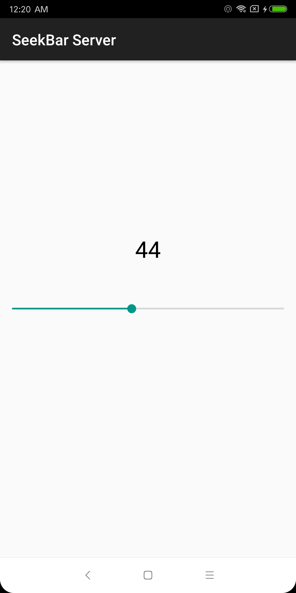
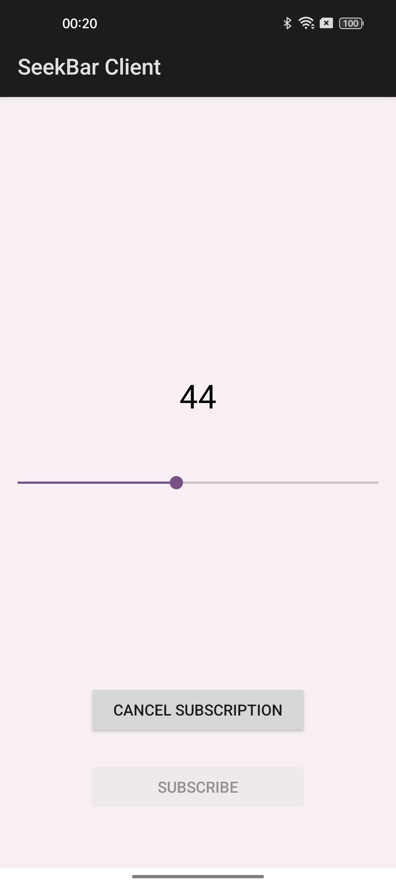

## DLNA SeekBar Demo
Demonstrate how to use UPnP protocol to discover, control and subscribe to other devices in the LAN.
In the same LAN, use the SeekBar on Android phone A to control the SeekBar on another Android phone B, and in turn, B can also notify A of its changes.

Server:  
  

Client:  

## License
The Library is distributed under Apache-2.0-license.